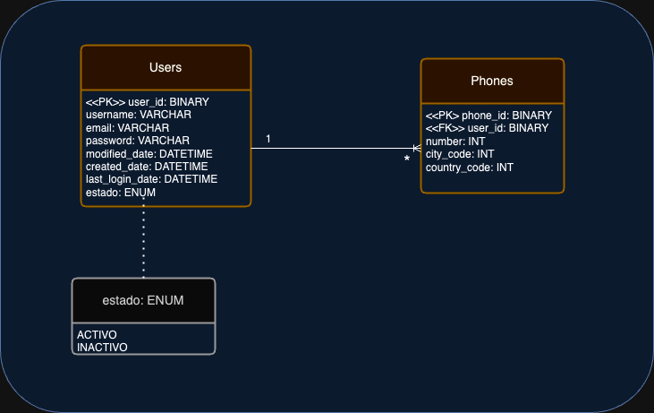
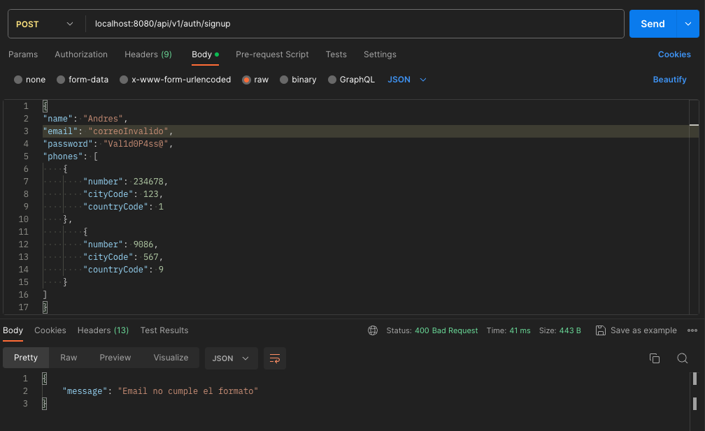
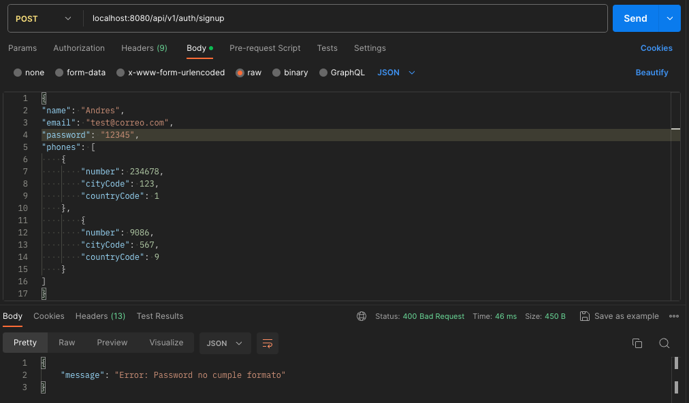
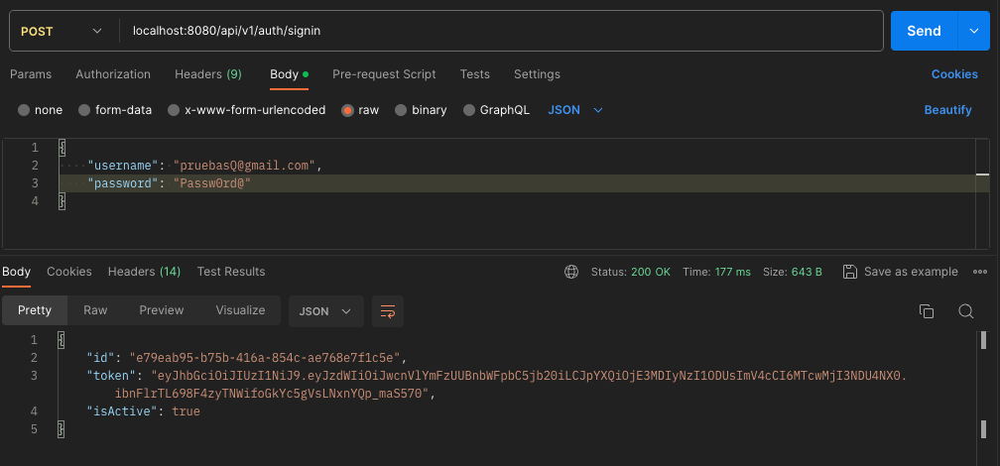
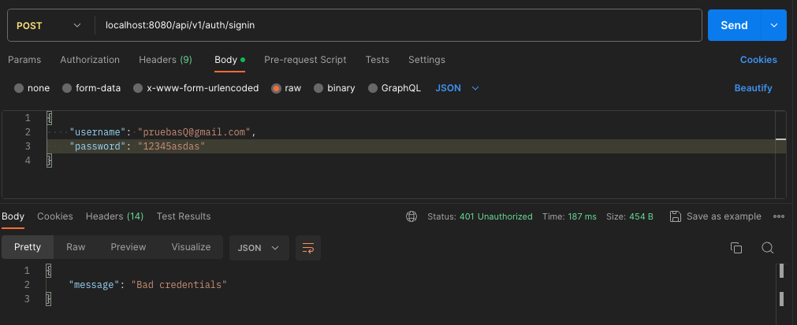
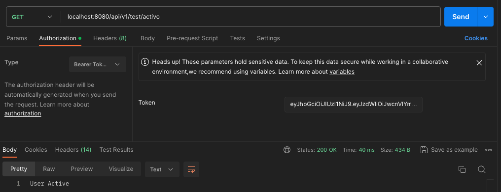
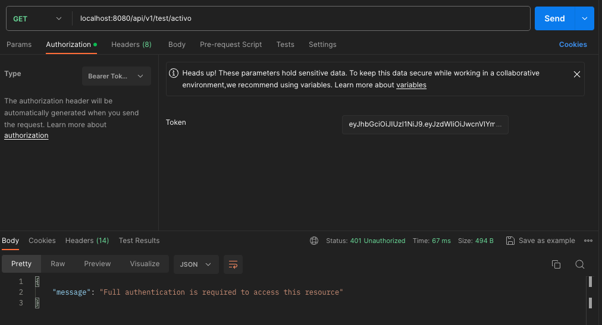

# MicroAuthenticator
## Descripción

Funcionalidad para crear usuarios, manejar y controlar
la autenticación y seguridad.

## Diagrama donde se muestra el registro, el inició de sesión y acceso a recursos.


## Manual de Uso

### Configuración Base de datos

Si se desea usar MYSQL
```xml
<dependency>
    <groupId>com.mysql</groupId>
    <artifactId>mysql-connector-j</artifactId>
    <scope>runtime</scope>
</dependency>
```

O por el contrario usar la Base de datos integrada H2 (Recomendada para realizar los UnitTest)
```xml
<dependency>
    <groupId>com.h2database</groupId>
    <artifactId>h2</artifactId>
    <scope>runtime</scope>
</dependency>
```
### Diagrama tablas Base de datos




## Postman

[CollectionAuthenticator.postman_collection.json](..%2F..%2F..%2F..%2FDownloads%2FCollectionAuthenticator.postman_collection.json)

### Registro

Creación de Usuario exitoso


Creación de Usuario, correo electrónico ya está registrado


Creación de Usuario, correo electrónico no cumple formato



Creación de Usuario, password no cumple regla



### Ingreso

Ingreso de Usuario exitoso



Ingreso de Usuario, credenciales incorrectos



### Acceso a Recursos

Acceso con token JWT correcto



Acceso con token JWT incorrecto

### Ingreso


