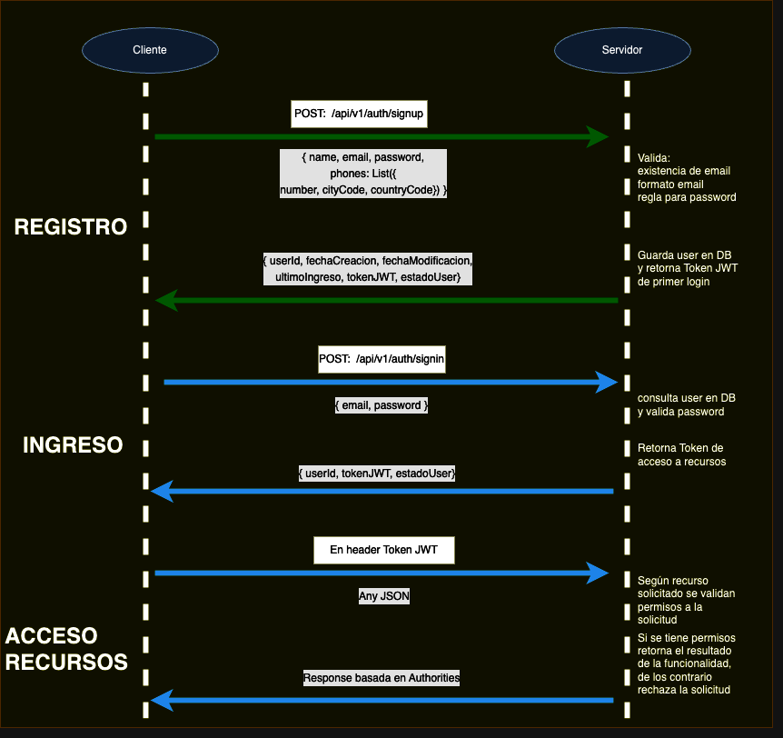
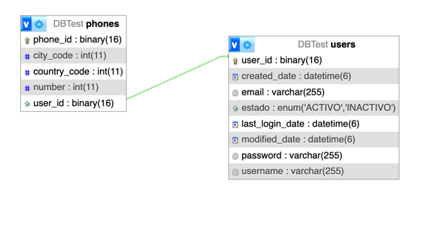
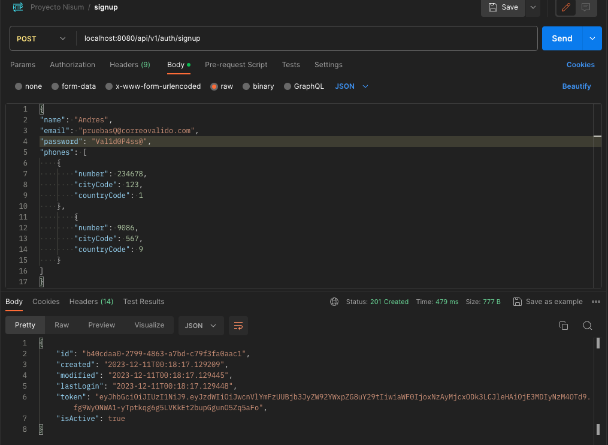
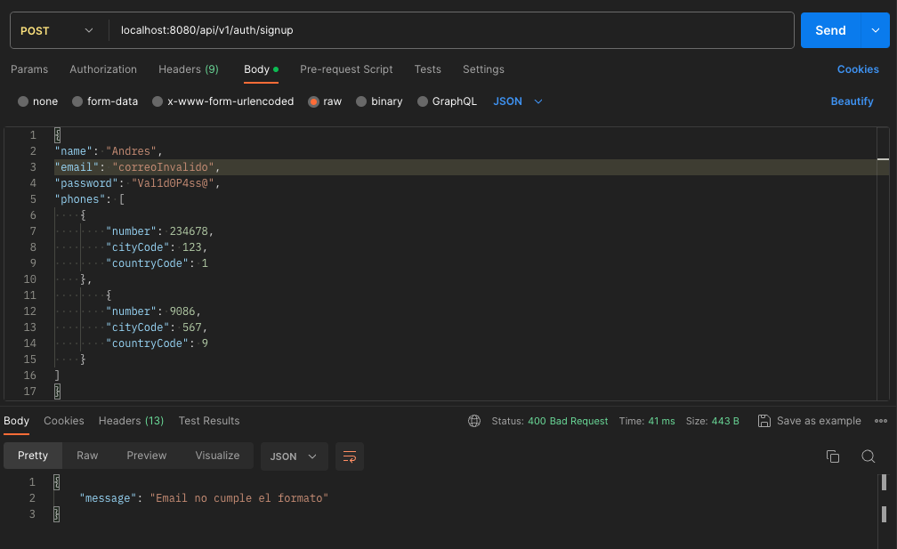
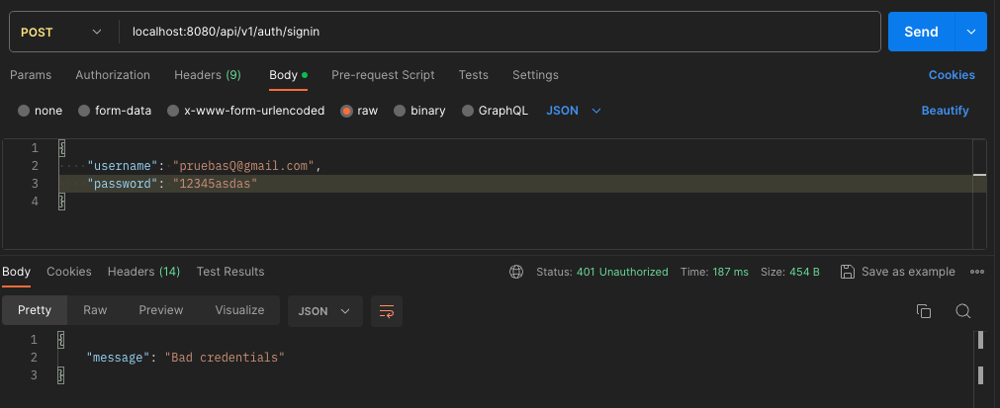
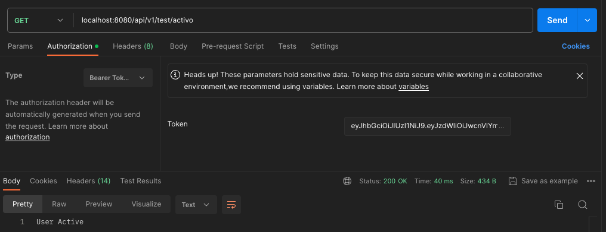
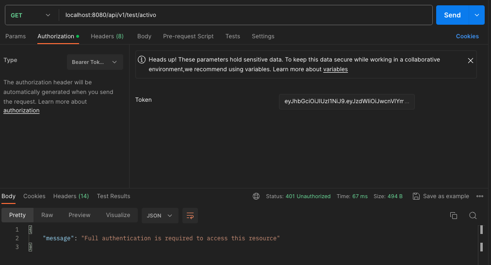

# MicroAuthenticator
## Descripción

Funcionalidad para crear usuarios, manejar y controlar
la autenticación y seguridad.

## Diagrama donde se muestra el registro, el inició de sesión y acceso a recursos.



## Manual de Uso

### Configuración Base de datos

Si se desea usar MYSQL
```xml
<dependency>
    <groupId>com.mysql</groupId>
    <artifactId>mysql-connector-j</artifactId>
    <scope>runtime</scope>
</dependency>
```

O por el contrario usar la Base de datos integrada H2 (Recomendada para realizar los UnitTest)
```xml
<dependency>
    <groupId>com.h2database</groupId>
    <artifactId>h2</artifactId>
    <scope>runtime</scope>
</dependency>
```
### Diagrama tablas Base de datos



### Script tablas base de datos

```txt
--
-- Base de datos: `DBTest`
--

-- --------------------------------------------------------

--
-- Estructura de tabla para la tabla `phones`
--

CREATE TABLE `phones` (
  `phone_id` binary(16) NOT NULL,
  `city_code` int(11) DEFAULT NULL,
  `country_code` int(11) DEFAULT NULL,
  `number` int(11) DEFAULT NULL,
  `user_id` binary(16) DEFAULT NULL
) ENGINE=InnoDB DEFAULT CHARSET=utf8mb4 COLLATE=utf8mb4_general_ci;

--
-- Estructura de tabla para la tabla `users`
--

CREATE TABLE `users` (
  `user_id` binary(16) NOT NULL,
  `created_date` datetime(6) DEFAULT NULL,
  `email` varchar(255) DEFAULT NULL,
  `estado` enum('ACTIVO','INACTIVO') DEFAULT NULL,
  `last_login_date` datetime(6) DEFAULT NULL,
  `modified_date` datetime(6) DEFAULT NULL,
  `password` varchar(255) DEFAULT NULL,
  `username` varchar(255) DEFAULT NULL
) ENGINE=InnoDB DEFAULT CHARSET=utf8mb4 COLLATE=utf8mb4_general_ci;

--
-- Indices de la tabla `phones`
--
ALTER TABLE `phones`
  ADD PRIMARY KEY (`phone_id`),
  ADD KEY `FKmg6d77tgqfen7n1g763nvsqe3` (`user_id`);

--
-- Indices de la tabla `users`
--
ALTER TABLE `users`
  ADD PRIMARY KEY (`user_id`);

--
-- Filtros para la tabla `phones`
--

ALTER TABLE `phones`
  ADD CONSTRAINT `FKmg6d77tgqfen7n1g763nvsqe3` FOREIGN KEY (`user_id`) REFERENCES `users` (`user_id`);
COMMIT;

```
## Postman

[Colección para Postman](Documentacion/CollectionAuthenticator.postman_collection.json)

### Registro

Creación de Usuario exitoso



Creación de Usuario, correo electrónico ya está registrado


Creación de Usuario, correo electrónico no cumple formato



Creación de Usuario, password no cumple regla


### Ingreso

Ingreso de Usuario exitoso


Ingreso de Usuario, credenciales incorrectos



### Acceso a Recursos

Acceso con token JWT correcto



Acceso con token JWT incorrecto



## Documentación Swagger

```yml
openapi: 3.0.1
info:
  title: Authenticator JWT
  description: Proyecto SpringBoot con seguridad web para creacion y login de usuarios con tecnologia JWT
  contact:
    name: Vincetl Hernando Guerrero Mendez
    url: https://www.linkedin.com/in/vincetl-guerrero
  version: v1
servers:
  - url: http://IpServer:Puerto/
    variables: {}
paths:
  /api/v1/auth/signup:
    post:
      tags:
        - auth-controller
      operationId: createUser
      requestBody:
        content:
          application/json:
            schema:
              $ref: '#/components/schemas/SignupRequest'
        required: true
      responses:
        '200':
          description: OK
          content:
            '*/*':
              schema:
                $ref: '#/components/schemas/SignupResponse'
        '401':
          description: Unauthorized
          content:
            '*/*':
              schema:
                $ref: '#/components/schemas/GeneralResponse'
  /api/v1/auth/signin:
    post:
      tags:
        - auth-controller
      operationId: authenticateUser
      requestBody:
        content:
          application/json:
            schema:
              $ref: '#/components/schemas/LoginRequest'
        required: true
      responses:
        '200':
          description: OK
          content:
            '*/*':
              schema:
                $ref: '#/components/schemas/SigninResponse'
        '401':
          description: Unauthorized
          content:
            '*/*':
              schema:
                $ref: '#/components/schemas/GeneralResponse'
  /api/v1/test/auth:
    get:
      tags:
        - test-controller
      operationId: userNoActive
      responses:
        '200':
          description: OK
          content:
            '*/*':
              schema:
                type: string
        '401':
          description: Unauthorized
          content:
            '*/*':
              schema:
                $ref: '#/components/schemas/GeneralResponse'
  /api/v1/test/all:
    get:
      tags:
        - test-controller
      operationId: allAccess
      responses:
        '200':
          description: OK
          content:
            '*/*':
              schema:
                type: object
        '401':
          description: Unauthorized
          content:
            '*/*':
              schema:
                $ref: '#/components/schemas/GeneralResponse'
  /api/v1/test/activo:
    get:
      tags:
        - test-controller
      operationId: userActive
      responses:
        '200':
          description: OK
          content:
            '*/*':
              schema:
                type: string
        '401':
          description: Unauthorized
          content:
            '*/*':
              schema:
                $ref: '#/components/schemas/GeneralResponse'
components:
  schemas:
    LoginRequest:
      required:
        - password
        - username
      type: object
      properties:
        username:
          type: string
        password:
          type: string
    SigninResponse:
      type: object
      properties:
        id:
          type: string
          format: uuid
        token:
          type: string
        isActive:
          type: boolean
    PhoneDTO:
      required:
        - cityCode
        - countryCode
        - number
      type: object
      properties:
        number:
          type: integer
          format: int32
        cityCode:
          type: integer
          format: int32
        countryCode:
          type: integer
          format: int32
    SignupRequest:
      required:
        - email
        - name
        - password
      type: object
      properties:
        name:
          type: string
        email:
          type: string
        password:
          type: string
        phones:
          type: array
          items:
            $ref: '#/components/schemas/PhoneDTO'
    SignupResponse:
      type: object
      properties:
        id:
          type: string
          format: uuid
        created:
          type: string
          format: date-time
        modified:
          type: string
          format: date-time
        lastLogin:
          type: string
          format: date-time
        token:
          type: string
        isActive:
          type: boolean
    GeneralResponse:
      type: object
      properties:
        message:
          type: string
```

